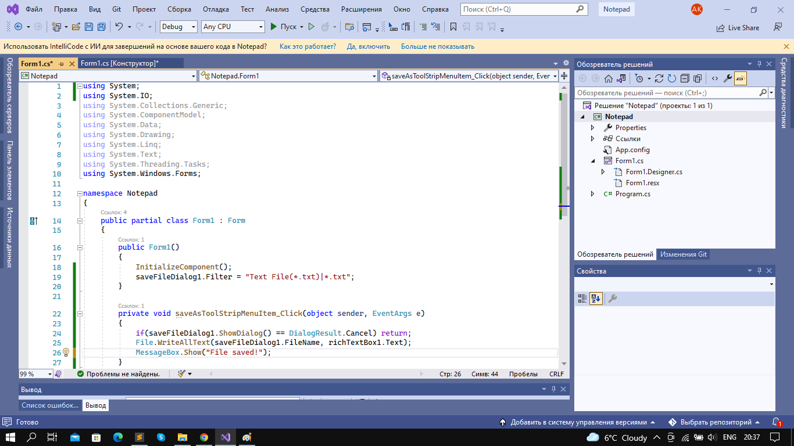

# Project description.
* This is a simple Notepad Application, which was made in Visiual Studio concretely in Windows form.

## Team
* Alisher Kachykeev com19

## What was used
* RichTextBox with property: Dock - fill, so when you will try to make the size of the app larger, there will not be any problems.

* MenuStrip, just to create menu with Save, Open etc properties.
* SaveFileDialog to save.

* OpenFileDialog to open.

* FontDialog to change font.

* ColorDialog to change color.

* ContextMenuStrip to create a little settings like copy,paste,cut and select. when you rightclicked with mouse.

